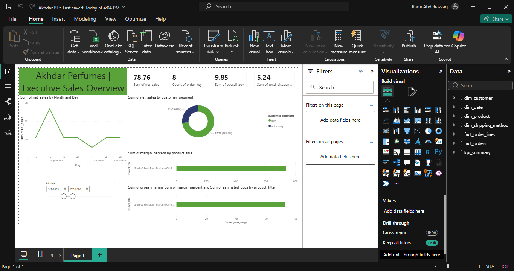

# Akhdar BI Command Center

**A production-ready reporting warehouse and Power BI dashboard for Akhdar Perfumes.**

This project demonstrates end-to-end Reporting Analyst skills: star schema data modeling, SQL KPI definitions, ETL pipelines, data quality testing, and business intelligence dashboards.



## 🎯 What This Dashboard Answers

- **How much did we sell this week, and how does it compare to last week?**
- **Which products are actually profitable after estimated COGS?**
- **What is AOV and how is it trending?**
- **How many customers are new vs returning? Repeat purchase rate?**
- **What's our refund rate?**
- **How is our marketing spend performing (ROAS)?**

## 🏗️ Architecture

```
┌─────────────────┐     ┌─────────────────┐     ┌─────────────────┐
│  Data Sources   │     │   PostgreSQL    │     │    Power BI     │
│                 │     │                 │     │                 │
│ • Shopify CSV   │────▶│ raw → staging   │────▶│ Executive View  │
│ • Materials     │     │ → warehouse     │     │ Product Profit  │
│ • Meta Ads      │     │ → marts         │     │ Customer        │
│ • GSC           │     │ → powerbi_export│     │ Marketing       │
└─────────────────┘     └─────────────────┘     └─────────────────┘
```

## 📊 Data Model (Star Schema)

### Dimensions
- `dim_date` - Calendar dimension
- `dim_product` - Products with SKU mapping
- `dim_customer` - PII-safe customer attributes (hashed IDs)
- `dim_channel` - Sales channels
- `dim_shipping_method` - Fulfillment methods
- `dim_material` - Raw materials and costs

### Facts
- `fact_order` - Order-level metrics (1 row per order)
- `fact_order_line` - Line-level metrics (1 row per line item)
- `fact_cogs_estimate` - Cost breakdown by ingredient
- `fact_marketing_spend` - Ad campaign performance
- `fact_gsc_daily` - Search console metrics

## 🚀 Quick Start

### Prerequisites
- Docker & Docker Compose
- Python 3.9+
- (Optional) Power BI Desktop

### Setup

1. **Clone and install dependencies:**
   ```bash
   git clone https://github.com/RamiNoodle733/akhdar-bi-command-center.git
   cd akhdar-bi-command-center
   pip install -r requirements.txt
   ```

2. **Start the database:**
   ```bash
   make up
   ```

3. **Run the full pipeline:**
   ```bash
   make all
   ```
   
   Or with sample data (for demo):
   ```bash
   python -m etl.run_all --sample
   ```

4. **Run tests:**
   ```bash
   make test
   ```

### Available Make Commands

| Command | Description |
|---------|-------------|
| `make up` | Start Postgres container |
| `make down` | Stop Postgres container |
| `make load` | Load raw CSV data |
| `make build` | Build staging + warehouse |
| `make test` | Run data quality tests |
| `make clean` | Remove containers and volumes |
| `make all` | Run full pipeline |

## 📁 Project Structure

```
akhdar-bi-command-center/
├── data/
│   ├── raw/              # Shopify exports (gitignored - PII)
│   ├── reference/        # SKU mappings, material costs
│   └── sample/           # Anonymized sample data
├── sql/
│   ├── schema/           # Database DDL
│   └── marts/            # KPI view definitions
├── etl/
│   ├── ingest_raw.py     # CSV → raw tables
│   ├── build_staging.py  # raw → staging tables
│   ├── build_dimensions.py
│   ├── build_facts.py
│   └── run_all.py        # Main entry point
├── tests/
│   └── test_data_quality.py
├── docs/
│   ├── kpi_definitions.md
│   └── data_dictionary.md
├── dashboard/
│   └── screenshots/
├── docker-compose.yml
├── Makefile
└── README.md
```

## 📈 KPI Definitions

| KPI | Formula | Source |
|-----|---------|--------|
| Gross Product Sales | `SUM(lineitem_price × quantity)` | fact_order |
| Discounts Total | `SUM(discount_amount)` | fact_order |
| Refunds Total | `SUM(refunded_amount)` | fact_order |
| Net Sales | `Subtotal - Refunded Amount` | fact_order |
| AOV | `Net Sales / Order Count` | marts.kpi_revenue_totals |
| Refund Rate | `Refunds Total / Gross Sales × 100` | marts.kpi_revenue_totals |
| Estimated COGS | Sum of ingredient costs per recipe | fact_cogs_estimate |
| Gross Margin | `Net Line Revenue - COGS` | fact_order_line |
| Margin % | `Gross Margin / Net Revenue × 100` | fact_order_line |
| Repeat Purchase Rate | `Customers with 2+ orders / Total Customers × 100` | marts.kpi_repeat_purchase_rate |

⚠️ **COGS Note:** Some aromachemical ingredients (Rose Givco 217, Galaxolide, Oud Synth, Sandalore) have unknown costs. The `has_missing_cost` flag indicates when margin calculations are incomplete.

## 🔒 Data Privacy

- Raw customer data (emails, addresses, phones) is kept in `data/raw/` and gitignored
- The `powerbi_export` schema contains **no PII fields**
- Customers are identified by SHA256 hash of email
- Sample data uses fake names/addresses for demo purposes

## 🛠️ Tech Stack

- **Database:** PostgreSQL 15
- **ETL:** Python (pandas, SQLAlchemy)
- **Testing:** pytest
- **Visualization:** Power BI
- **Infrastructure:** Docker Compose

## 📝 Adding New Products

1. Add SKU mapping to `data/reference/product_sku_map.csv`
2. Add recipe (BOM) to `data/reference/recipes.csv`
3. Add any new material costs to `data/reference/material_costs.csv`
4. Re-run pipeline: `make all`

## 🧪 Data Quality Checks

The test suite validates:
- ✅ Required columns present
- ✅ No null order IDs
- ✅ Date parsing accuracy
- ✅ Product SKU mapping coverage
- ✅ Non-negative amounts
- ✅ Subtotal = Gross - Discount (within $0.01)
- ✅ Total = Subtotal + Shipping + Tax (within $0.01)
- ✅ Line revenues sum to order totals
- ✅ No PII in export views

## 📊 Dashboard Pages

1. **Executive Overview** - Revenue, AOV, orders, margin trends
2. **Product Profitability** - Profit by SKU, margin %, COGS breakdown
3. **Customer Insights** - New vs returning, repeat rate, cohorts
4. **Marketing Performance** - ROAS, CPC, CTR by campaign

---

*Built as a portfolio project demonstrating Reporting Analyst skills.*

## ✅ Pipeline Results

Last run statistics:
- **8 orders** loaded from Shopify exports
- **8 line items** with product details
- **7 unique customers** (with hashed IDs)
- **2 products** (Shell v2, Shell v1)
- **$78.76 net revenue** (after $5.24 discounts)
- **25% discount usage rate** (2 of 8 orders)
- **26/26 tests passing** ✓

---

## Original README